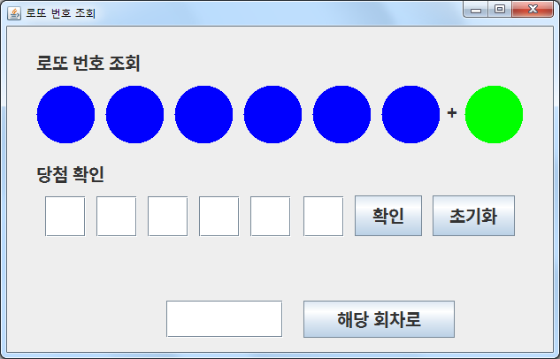
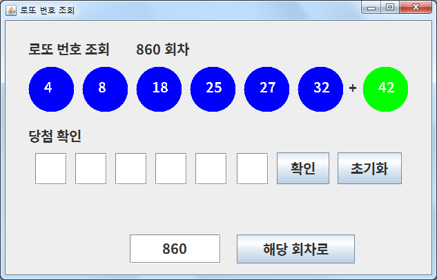
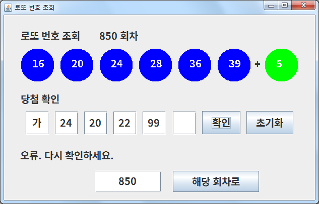

## LottoResult

### 개요
* 회차별 로또 번호 조회 / 내 번호 등수 확인 프로그램

### 설명
* 특정 회차의 로또 당첨 번호를 조회할 수 있습니다.
* 로또 번호와 회차를 기입하고 ‘확인’ 버튼을 누르면 당첨 결과를 알 수 있습니다.
* 동행복권 ( https://nlotto.co.kr/ ) 당첨번호 페이지에서 JSON 데이터를 파싱하여 출력합니다.
* ‘초기화’ 버튼을 누르면 당첨 확인란이 초기화됩니다.
* 회차 기입란에 포커스를 둔 채로 엔터 키를 누르면 ‘해당 회차로’ 버튼을 누르는 것과 똑같이 작동합니다.

### 기술
* JAVA
* Eclipse
* json-simple
* GitHub Desktop, GitHub

### 미리보기

